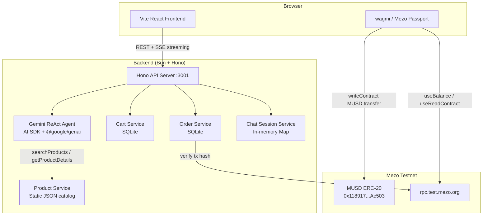
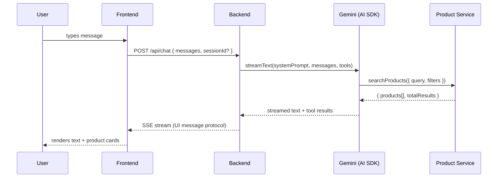
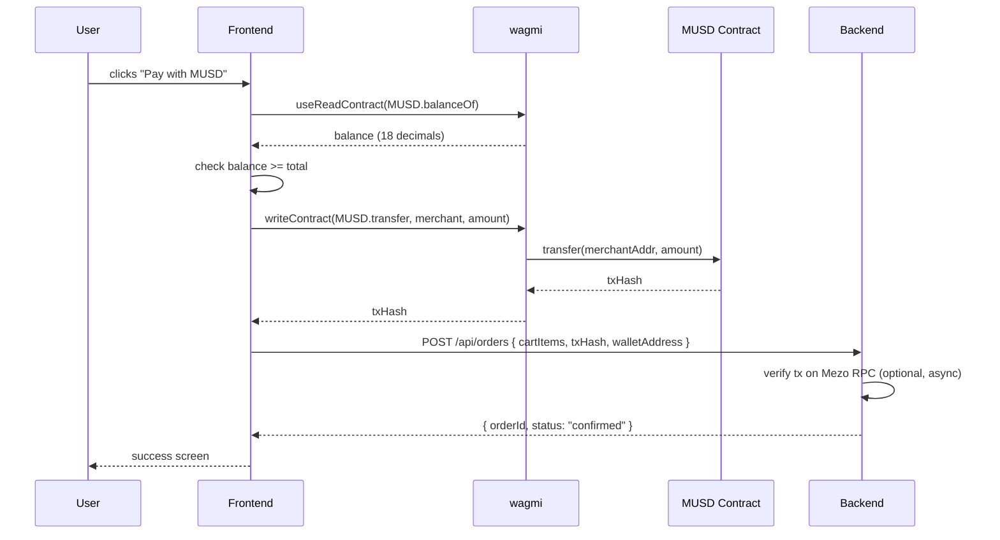
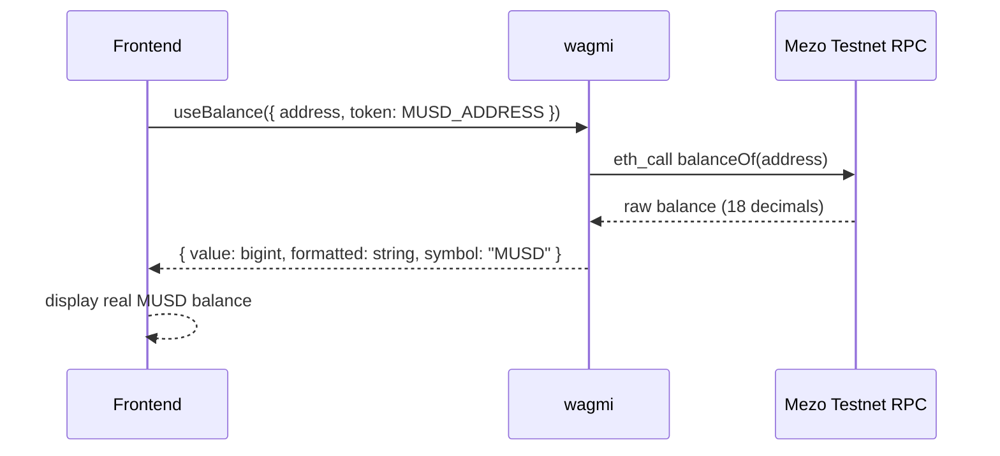

# Design Document: MezoShop

## Overview

MezoShop is an AI-powered shopping assistant built on the Mezo blockchain, targeting the Supernormal dApps — MUSD Track of the Mezo Hackathon. Users connect their Mezo Passport wallet, chat with a Gemini-powered ReAct agent to discover fashion products from a curated catalog, and pay with MUSD via a real on-chain ERC-20 transfer. The existing Vite + React + TypeScript frontend is wired to a new Bun + Hono backend; all mock data and simulated flows are replaced with live on-chain interactions on Mezo Testnet (Chain ID 31611).

The architecture is deliberately lean for hackathon speed: SQLite replaces PostgreSQL, in-memory session state replaces Redis, and the product catalog is a static JSON file rather than a scraping service. The MUSD payment is a direct `transfer()` call on the MUSD ERC-20 contract (`0x118917a40FAF1CD7a13dB0Ef56C86De7973Ac503` on testnet), executed from the user's wallet via wagmi `writeContract`, replacing the Crossmint payment rail used in the reference implementation.

---

## Architecture



---

## Sequence Diagrams

### Chat & Product Discovery



### MUSD Checkout



### MUSD Balance Display (Borrow Page)



---

## Components and Interfaces

### Backend: Hono API Server (`backend/src/index.ts`)

**Purpose**: Entry point; registers CORS, logging, routes.

**Routes**:
```typescript
GET  /health
POST /api/chat              // streaming LLM agent
GET  /api/cart              // list cart items
POST /api/cart              // add item
DELETE /api/cart/:itemId    // remove item
GET  /api/products          // list/search products (REST fallback)
GET  /api/products/:id      // product detail
POST /api/orders            // create order after MUSD tx
GET  /api/orders            // list user orders
```

**Auth**: Wallet address extracted from `X-Wallet-Address` header (set by frontend after wallet connection). No JWT — wallet address is the user identity.

---

### Backend: Product Service (`backend/src/services/product-service.ts`)

**Purpose**: Serves the static product catalog; supports fuzzy text search and filtering.

**Interface**:
```typescript
interface ProductService {
  search(params: SearchParams): Promise<SearchResult>
  getById(id: string): Promise<Product | null>
}

interface SearchParams {
  query: string
  category?: string
  brand?: string
  minPrice?: number   // in MUSD (not cents)
  maxPrice?: number
  page?: number
  limit?: number
}

interface SearchResult {
  products: Product[]
  total: number
  query: string
}
```

**Implementation**: Loads `catalog.json` at startup. Search is a simple in-memory filter + substring match on `name`, `brand`, `description`, `category`. No external search engine needed for ~50 products.

---

### Backend: Chat Agent (`backend/src/routes/chat.ts`)

**Purpose**: Hosts the Gemini ReAct agent via AI SDK `streamText`. Streams UI message protocol back to the frontend.

**Interface**:
```typescript
// POST /api/chat
interface ChatRequest {
  messages: UIMessage[]
  sessionId?: string
}
// Response: SSE stream (AI SDK UI message protocol)
// Header: X-Session-Id: <uuid>
```

**Tools registered**:
- `searchProducts` — delegates to ProductService
- `getProductDetails` — delegates to ProductService

**Session storage**: In-memory `Map<sessionId, UIMessage[]>`. Sessions are keyed by UUID, scoped to wallet address. Lost on server restart (acceptable for hackathon).

---

### Backend: Cart Service (`backend/src/services/cart-service.ts`)

**Purpose**: Persists cart items in SQLite.

**Interface**:
```typescript
interface CartService {
  list(walletAddress: string): Promise<CartItem[]>
  add(walletAddress: string, item: AddCartItemInput): Promise<CartItem>
  remove(walletAddress: string, itemId: string): Promise<void>
  clear(walletAddress: string): Promise<void>
}

interface CartItem {
  id: string
  walletAddress: string
  productId: string
  quantity: number
  size?: string
  color?: string
  addedAt: string
}

interface AddCartItemInput {
  productId: string
  quantity: number
  size?: string
  color?: string
}
```

**SQLite schema**:
```sql
CREATE TABLE cart_items (
  id TEXT PRIMARY KEY,
  wallet_address TEXT NOT NULL,
  product_id TEXT NOT NULL,
  quantity INTEGER NOT NULL DEFAULT 1,
  size TEXT,
  color TEXT,
  added_at TEXT NOT NULL
);
CREATE INDEX idx_cart_wallet ON cart_items(wallet_address);
```

---

### Backend: Order Service (`backend/src/services/order-service.ts`)

**Purpose**: Records confirmed MUSD purchases.

**Interface**:
```typescript
interface OrderService {
  create(input: CreateOrderInput): Promise<Order>
  list(walletAddress: string): Promise<Order[]>
}

interface CreateOrderInput {
  walletAddress: string
  items: { productId: string; quantity: number; priceMusd: number }[]
  totalMusd: number
  txHash: string
}

interface Order {
  id: string
  walletAddress: string
  items: OrderItem[]
  totalMusd: number
  txHash: string
  status: "pending" | "confirmed"
  createdAt: string
}
```

**SQLite schema**:
```sql
CREATE TABLE orders (
  id TEXT PRIMARY KEY,
  wallet_address TEXT NOT NULL,
  items_json TEXT NOT NULL,
  total_musd REAL NOT NULL,
  tx_hash TEXT NOT NULL,
  status TEXT NOT NULL DEFAULT 'pending',
  created_at TEXT NOT NULL
);
CREATE INDEX idx_orders_wallet ON orders(wallet_address);
```

---

### Frontend: Chat Hook (`src/hooks/useChat.ts`)

**Purpose**: Replaces the mock `getAIResponse()` in Dashboard with a real streaming connection to the backend.

**Interface**:
```typescript
interface UseChatReturn {
  messages: UIMessage[]
  isStreaming: boolean
  sessionId: string | null
  sendMessage: (text: string) => Promise<void>
  reset: () => void
}

function useChat(walletAddress: string): UseChatReturn
```

**Implementation**: Uses AI SDK's `useChat` hook (or a manual `fetch` with SSE reader) pointed at `VITE_API_URL/api/chat`. Attaches `X-Wallet-Address` header.

---

### Frontend: MUSD Checkout Hook (`src/hooks/useMUSDCheckout.ts`)

**Purpose**: Executes the on-chain MUSD transfer and records the order.

**Interface**:
```typescript
interface UseMUSDCheckoutReturn {
  checkout: (cartItems: CartItem[], totalMusd: number) => Promise<CheckoutResult>
  isPending: boolean
  error: string | null
}

interface CheckoutResult {
  orderId: string
  txHash: string
  status: "confirmed"
}

function useMUSDCheckout(): UseMUSDCheckoutReturn
```

**Implementation**:
1. Read MUSD balance via `useBalance({ token: MUSD_ADDRESS })`
2. Guard: balance >= total
3. Call `writeContract({ address: MUSD_ADDRESS, abi: ERC20_ABI, functionName: "transfer", args: [MERCHANT_ADDRESS, amountWei] })`
4. Wait for `useWaitForTransactionReceipt`
5. POST to `/api/orders` with txHash
6. Clear cart

---

### Frontend: MUSD Balance Hook (`src/hooks/useMUSDBalance.ts`)

**Purpose**: Reads real MUSD balance from Mezo Testnet for the Borrow page.

**Interface**:
```typescript
function useMUSDBalance(address?: string): {
  balance: bigint | undefined
  formatted: string
  isLoading: boolean
}
```

**Implementation**: Thin wrapper around wagmi `useBalance({ address, token: MUSD_TESTNET_ADDRESS, chainId: MEZO_TESTNET_CHAIN_ID })`.

---

## Data Models

### Product (catalog)

```typescript
interface Product {
  id: string           // e.g. "phantom-runner-001"
  name: string
  brand: string
  category: string     // "Shoes" | "Dresses" | "Bags" | "Tops" | "Bottoms" | "Coats" | "Loungewear"
  musd: number         // price in MUSD (e.g. 89)
  tag: string          // "New Drop" | "Bestseller" | "Limited" | "Exclusive" | "Hot Pick"
  description: string
  images: string[]     // relative paths served by Vite static assets
  colors?: string[]
  sizes?: string[]
}
```

The existing `src/lib/products.ts` catalog (38 products) is copied to `backend/src/catalog.json` and served by the backend. The frontend continues to use local images from `public/products/`.

### UIMessage (AI SDK)

```typescript
// Standard AI SDK UIMessage — used for chat history in both frontend and backend
interface UIMessage {
  id: string
  role: "user" | "assistant" | "tool"
  parts: MessagePart[]
}
```

### MUSD Contract Constants

```typescript
// backend/src/lib/mezo.ts  AND  src/lib/musd.ts
const MUSD_TESTNET_ADDRESS = "0x118917a40FAF1CD7a13dB0Ef56C86De7973Ac503"
const MUSD_MAINNET_ADDRESS = "0xdD468A1DDc392dcdbEf6db6e34E89AA338F9F186"
const MEZO_TESTNET_CHAIN_ID = 31611
const MEZO_MAINNET_CHAIN_ID = 31612
const MERCHANT_ADDRESS = process.env.MERCHANT_WALLET_ADDRESS  // env var

const ERC20_ABI = [
  { name: "transfer",   type: "function", inputs: [{ name: "to", type: "address" }, { name: "amount", type: "uint256" }], outputs: [{ name: "", type: "bool" }] },
  { name: "balanceOf",  type: "function", inputs: [{ name: "account", type: "address" }], outputs: [{ name: "", type: "uint256" }] },
  { name: "allowance",  type: "function", inputs: [{ name: "owner", type: "address" }, { name: "spender", type: "address" }], outputs: [{ name: "", type: "uint256" }] },
  { name: "decimals",   type: "function", inputs: [], outputs: [{ name: "", type: "uint8" }] },
] as const
```

---

## Key Functions with Formal Specifications

### `searchProducts(params)` — Product Service

```typescript
function search(params: SearchParams): Promise<SearchResult>
```

**Preconditions:**
- `params.query` is a non-empty string
- `params.page >= 1` if provided
- `params.limit` is between 1 and 20 if provided

**Postconditions:**
- Returns `SearchResult` with `products` array (may be empty)
- All returned products match at least one of: name, brand, description, or category contains `params.query` (case-insensitive)
- If `params.category` is set, all returned products have `product.category === params.category`
- If `params.minPrice` is set, all returned products have `product.musd >= params.minPrice`
- If `params.maxPrice` is set, all returned products have `product.musd <= params.maxPrice`
- `result.total` equals the count of all matching products before pagination
- `result.products.length <= params.limit ?? 5`

---

### `checkout(cartItems, totalMusd)` — Frontend MUSD Checkout

```typescript
async function checkout(cartItems: CartItem[], totalMusd: number): Promise<CheckoutResult>
```

**Preconditions:**
- `cartItems.length > 0`
- `totalMusd > 0`
- Wallet is connected (wagmi `useAccount().isConnected === true`)
- User is on Mezo Testnet (chainId === 31611)

**Postconditions:**
- If MUSD balance < totalMusd: throws `InsufficientBalanceError` before any on-chain call
- If `writeContract` succeeds: `txHash` is a valid 0x-prefixed hex string
- If `waitForTransactionReceipt` succeeds: order is recorded in backend
- Cart is cleared after successful order creation
- Returns `{ orderId, txHash, status: "confirmed" }`

**Error cases:**
- User rejects wallet signature → throws `UserRejectedRequestError`
- Network error → throws with descriptive message, cart is NOT cleared

---

### `streamChat(messages, sessionId?)` — Chat Route

```typescript
// POST /api/chat
async function handleChat(c: Context): Promise<Response>
```

**Preconditions:**
- `messages` array has at least one entry
- Last message has `role === "user"`
- `X-Wallet-Address` header is present and is a valid EVM address

**Postconditions:**
- Returns SSE stream with Content-Type `text/event-stream`
- `X-Session-Id` response header contains the session UUID
- LLM calls `searchProducts` at most once per user turn (stopWhen: stepCountIs(3))
- All streamed messages are appended to the in-memory session
- If `sessionId` is provided and not found: returns 404

---

## Algorithmic Pseudocode

### Main Chat Processing Algorithm

```pascal
ALGORITHM handleChatRequest(request)
INPUT: request { messages, sessionId?, walletAddress }
OUTPUT: SSE stream

BEGIN
  walletAddress ← request.headers["X-Wallet-Address"]
  IF NOT isValidAddress(walletAddress) THEN
    RETURN 400 Bad Request
  END IF

  // Session resolution
  IF request.sessionId IS NULL THEN
    sessionId ← generateUUID()
    sessions.set(sessionId, { walletAddress, messages: [] })
  ELSE
    session ← sessions.get(request.sessionId)
    IF session IS NULL THEN
      RETURN 404 Not Found
    END IF
    IF session.walletAddress ≠ walletAddress THEN
      RETURN 403 Forbidden
    END IF
    sessionId ← request.sessionId
  END IF

  // Build message history
  history ← sessions.get(sessionId).messages
  userMessage ← last(request.messages)
  allMessages ← history + [userMessage]

  // Stream LLM response
  stream ← streamText({
    model: gemini,
    system: SYSTEM_PROMPT,
    messages: allMessages,
    tools: { searchProducts, getProductDetails },
    stopWhen: stepCountIs(3)
  })

  // Persist on finish
  stream.onFinish(finalMessages → {
    sessions.get(sessionId).messages ← allMessages + finalMessages
  })

  RETURN SSE stream WITH header "X-Session-Id: " + sessionId
END
```

### MUSD Checkout Algorithm

```pascal
ALGORITHM executeMUSDCheckout(cartItems, totalMusd)
INPUT: cartItems[], totalMusd (number)
OUTPUT: CheckoutResult OR Error

BEGIN
  // 1. Validate preconditions
  ASSERT cartItems.length > 0
  ASSERT totalMusd > 0
  ASSERT wallet.isConnected = true
  ASSERT wallet.chainId = MEZO_TESTNET_CHAIN_ID

  // 2. Check balance
  balance ← await readContract(MUSD.balanceOf(wallet.address))
  amountWei ← parseUnits(totalMusd.toString(), 18)

  IF balance < amountWei THEN
    THROW InsufficientBalanceError(
      "Need " + totalMusd + " MUSD, have " + formatUnits(balance, 18)
    )
  END IF

  // 3. Execute on-chain transfer
  txHash ← await writeContract({
    address: MUSD_ADDRESS,
    abi: ERC20_ABI,
    functionName: "transfer",
    args: [MERCHANT_ADDRESS, amountWei]
  })

  // 4. Wait for confirmation
  receipt ← await waitForTransactionReceipt({ hash: txHash })
  ASSERT receipt.status = "success"

  // 5. Record order in backend
  order ← await POST /api/orders {
    items: cartItems,
    totalMusd,
    txHash,
    walletAddress: wallet.address
  }

  // 6. Clear cart
  await clearCart(wallet.address)

  RETURN { orderId: order.id, txHash, status: "confirmed" }
END
```

### Product Search Algorithm

```pascal
ALGORITHM searchProducts(catalog, params)
INPUT: catalog Product[], params SearchParams
OUTPUT: SearchResult

BEGIN
  results ← catalog

  // Text filter
  IF params.query IS NOT EMPTY THEN
    q ← lowercase(params.query)
    results ← FILTER results WHERE
      lowercase(p.name) CONTAINS q OR
      lowercase(p.brand) CONTAINS q OR
      lowercase(p.description) CONTAINS q OR
      lowercase(p.category) CONTAINS q
  END IF

  // Category filter
  IF params.category IS NOT NULL THEN
    results ← FILTER results WHERE p.category = params.category
  END IF

  // Brand filter
  IF params.brand IS NOT NULL THEN
    results ← FILTER results WHERE lowercase(p.brand) CONTAINS lowercase(params.brand)
  END IF

  // Price filters
  IF params.minPrice IS NOT NULL THEN
    results ← FILTER results WHERE p.musd >= params.minPrice
  END IF
  IF params.maxPrice IS NOT NULL THEN
    results ← FILTER results WHERE p.musd <= params.maxPrice
  END IF

  total ← length(results)

  // Pagination
  page ← params.page ?? 1
  limit ← params.limit ?? 5
  offset ← (page - 1) * limit
  results ← results[offset .. offset + limit]

  RETURN { products: results, total, query: params.query }
END
```

---

## Error Handling

### Insufficient MUSD Balance

**Condition**: User's MUSD balance < cart total before `writeContract` is called.
**Response**: Show inline error in checkout UI: "You need X MUSD but only have Y MUSD. Get MUSD from the Mezo testnet faucet."
**Recovery**: Link to Mezo testnet faucet / borrow page.

### User Rejects Wallet Transaction

**Condition**: wagmi `writeContract` throws `UserRejectedRequestError`.
**Response**: Show dismissible toast: "Transaction cancelled." Cart is preserved.
**Recovery**: User can retry checkout.

### Wrong Network

**Condition**: `useAccount().chainId !== 31611` (Mezo Testnet).
**Response**: Show banner: "Switch to Mezo Testnet to continue." Use wagmi `useSwitchChain` to offer one-click switch.
**Recovery**: Auto-retry checkout after chain switch.

### Backend Unreachable

**Condition**: `fetch` to backend throws `NetworkError` or returns 5xx.
**Response**: Show error state in chat: "Shopping assistant is temporarily unavailable."
**Recovery**: Retry button; cart state is preserved in frontend memory.

### LLM Tool Call Failure

**Condition**: `searchProducts` throws inside the AI SDK tool execute handler.
**Response**: AI SDK catches the error and the LLM receives a tool error result; LLM responds with a graceful fallback message.
**Recovery**: User can rephrase query.

### Transaction Confirmed but Backend Order Creation Fails

**Condition**: `writeContract` succeeds (txHash exists) but `POST /api/orders` returns 5xx.
**Response**: Show success screen with txHash and a warning: "Order recording failed — your payment went through. Save your tx hash: {txHash}."
**Recovery**: User can contact support with txHash. Cart is still cleared.

---

## Testing Strategy

### Unit Testing Approach

Test the product search algorithm in isolation with the static catalog:
- Empty query returns all products (up to limit)
- Category filter returns only matching products
- Price range filter is inclusive on both bounds
- Pagination: page 2 returns the correct slice
- Combined filters are ANDed together

### Property-Based Testing Approach

**Property Test Library**: fast-check (TypeScript)

Key properties:
- `∀ query: search(catalog, { query }).products.every(p => matchesQuery(p, query))`
- `∀ params: search(catalog, params).products.length <= params.limit ?? 5`
- `∀ params: search(catalog, params).total >= search(catalog, params).products.length`
- `∀ minPrice, maxPrice where minPrice <= maxPrice: search(catalog, { minPrice, maxPrice }).products.every(p => p.musd >= minPrice && p.musd <= maxPrice)`

### Integration Testing Approach

- `POST /api/chat` with a product query → response contains streamed product cards
- `POST /api/cart` → `GET /api/cart` returns the added item
- `DELETE /api/cart/:id` → item is removed
- `POST /api/orders` with a mock txHash → order is persisted and returned

---

## Performance Considerations

- Product catalog is loaded once at startup into memory (~50 products, negligible size). No DB query per search.
- Chat sessions are in-memory; no DB round-trip per message. Acceptable for hackathon; would need Redis for multi-instance production.
- Gemini streaming via AI SDK SSE keeps time-to-first-token low.
- Frontend uses TanStack Query for cart/orders caching; staleTime of 30s avoids redundant fetches.
- MUSD balance is read on-chain via wagmi `useBalance` with a 10s refetch interval on the Borrow/Checkout pages.

---

## Security Considerations

- No private keys are stored in the backend. The MUSD transfer is signed by the user's wallet in the browser.
- `MERCHANT_ADDRESS` is an env var; never hardcoded in frontend bundle.
- CORS is restricted to the frontend origin in production.
- `X-Wallet-Address` header is not authenticated (no signature verification) — acceptable for a hackathon demo. In production, require a signed message (SIWE).
- SQLite file is not exposed via any API route.
- Gemini API key is backend-only; never sent to the frontend.

---

## Dependencies

### New Backend (`backend/`)

| Package | Purpose |
|---|---|
| `bun` | Runtime + built-in SQLite |
| `hono` | HTTP framework |
| `ai` (Vercel AI SDK) | `streamText`, `tool`, `UIMessage` |
| `@ai-sdk/google` | Gemini provider for AI SDK |
| `zod` | Schema validation |
| `viem` | EVM utilities (address validation, `parseUnits`) |

### Frontend (additions to existing `package.json`)

| Package | Purpose |
|---|---|
| `ai` (Vercel AI SDK) | `useChat` hook for SSE streaming |
| Already present: `wagmi`, `viem` | `writeContract`, `useBalance`, `useWaitForTransactionReceipt` |

### Mezo Testnet

| Resource | Value |
|---|---|
| Chain ID | 31611 |
| RPC | `https://rpc.test.mezo.org` |
| MUSD contract | `0x118917a40FAF1CD7a13dB0Ef56C86De7973Ac503` |
| Explorer | `https://explorer.test.mezo.org` |

---

## Correctness Properties

*A property is a characteristic or behavior that should hold true across all valid executions of a system — essentially, a formal statement about what the system should do. Properties serve as the bridge between human-readable specifications and machine-verifiable correctness guarantees.*

### Property 1: Search Filter Correctness

*For any* combination of search parameters (query string, category, brand, minPrice, maxPrice), every product returned by `Product_Service.search` must satisfy all provided filter conditions simultaneously — the query must appear in at least one text field (case-insensitive), the category must match exactly, the brand must be a substring match, and the price must fall within the specified range.

**Validates: Requirements 2.2, 2.3, 2.4, 2.5, 2.6, 2.7**

---

### Property 2: Search Pagination and Total Correctness

*For any* search parameters with pagination, `result.products.length` must be less than or equal to `limit` (default 5), and `result.total` must equal the count of all matching products before pagination is applied (i.e., `result.total >= result.products.length`).

**Validates: Requirements 2.8, 2.9**

---

### Property 3: Product Lookup Round-Trip

*For any* product `p` in the catalog, `Product_Service.getById(p.id)` must return a product equal to `p`. For any ID not present in the catalog, `getById` must return `null`.

**Validates: Requirements 2.10**

---

### Property 4: Search Completeness (No False Negatives)

*For any* product `p` in the catalog and any query string `q` such that `p.name` contains `q` (case-insensitive), `p` must appear in the full (unpaginated) results of `search(catalog, { query: q })`.

**Validates: Requirements 2.2**

---

### Property 5: Cart Isolation

*For any* two distinct wallet addresses A and B, cart items added by wallet A must never appear in the cart returned for wallet B, and vice versa. All cart queries are strictly scoped by `wallet_address`.

**Validates: Requirements 4.2, 4.4**

---

### Property 6: Cart CRUD Round-Trip

*For any* valid cart item input, adding the item via `Cart_Service.add` and then listing the cart via `Cart_Service.list` must return a list containing an item matching the input. After deleting that item via `Cart_Service.remove`, the item must no longer appear in the list. After calling `Cart_Service.clear`, the cart must be empty.

**Validates: Requirements 4.1, 4.3, 4.5**

---

### Property 7: Balance Guard

*For any* MUSD balance value and total checkout amount where `balance < totalMusd`, the `Checkout_Hook` must throw `InsufficientBalanceError` and must not invoke `writeContract`. The on-chain transfer is never initiated when the user cannot afford the purchase.

**Validates: Requirements 5.2**

---

### Property 8: MUSD Amount Conversion Correctness

*For any* `totalMusd` value (a positive number), the `amountWei` passed to `writeContract` must equal `parseUnits(totalMusd.toString(), 18)`. No rounding, truncation, or scaling error is permitted.

**Validates: Requirements 5.3**

---

### Property 9: Cart Cleared After Successful Checkout

*For any* non-empty cart, after a successful checkout (on-chain transfer confirmed and order recorded), `Cart_Service.list` for that wallet address must return an empty array.

**Validates: Requirements 5.6**

---

### Property 10: Session Ownership

*For any* two distinct wallet addresses A and B, a chat session created by wallet A (with its `sessionId`) must return a 403 Forbidden response when accessed with wallet B's `X-Wallet-Address` header. Sessions are keyed by `(sessionId, walletAddress)` pair.

**Validates: Requirements 3.6**

---

### Property 11: Session Message Persistence Round-Trip

*For any* sequence of chat messages sent in a session, after the Agent finishes streaming, `Session_Service` must contain all prior history messages plus all new messages from that turn. Retrieving the session must return the complete accumulated history.

**Validates: Requirements 3.4, 3.9**

---

### Property 12: Agent Step Bound

*For any* user message sent to the Agent, the total number of tool-call steps executed must be less than or equal to 3. The agent must never exceed the `stopWhen: stepCountIs(3)` limit regardless of the query content.

**Validates: Requirements 3.8**

---

### Property 13: Order Isolation

*For any* two distinct wallet addresses A and B, orders created by wallet A must never appear in the order list returned for wallet B. All order queries are strictly scoped by `wallet_address`.

**Validates: Requirements 6.2, 6.4**

---

### Property 14: Idempotent Order Creation

*For any* `txHash`, submitting `POST /api/orders` twice with the same `txHash` must return the same existing order on the second call and must not create a duplicate record. The total number of orders with that `txHash` must always be exactly 1.

**Validates: Requirements 6.3**

---

### Property 15: Sensitive Data Not Leaked

*For any* API response from the Backend, the response body and headers must not contain the Gemini API key, the raw SQLite file contents, or the `MERCHANT_ADDRESS` value.

**Validates: Requirements 10.4**
